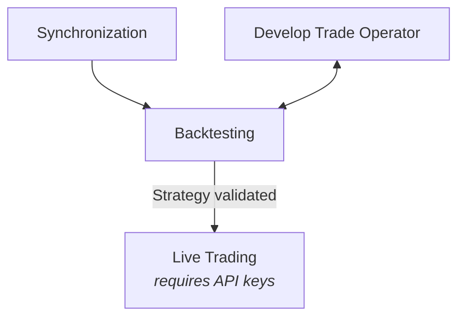
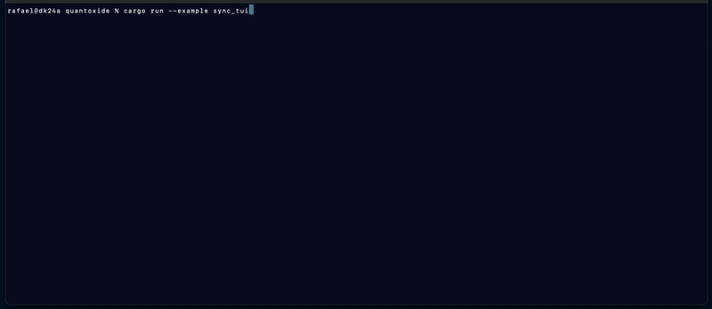

# Quantoxide

A Rust framework for developing, backtesting, and deploying algorithmic trading strategies for
Bitcoin futures.

This crate is built on top of [`lnm-sdk`], using the [LN Markets] API. It provides a complete
workflow from strategy development to live trading, with local historical data testing capabilities.

> **Disclaimer**: This is alpha software provided "as is" without warranty of any kind. Understand
> that bugs may result in loss of assets. Use at your own risk.

## Getting Started

### Rust Version

This project's MSRV is `1.88`.

### Dependencies

```toml
[dependencies]
lnm-sdk = "<lnm-sdk-version>"
quantoxide = "<quantoxide-version>"
```

### Requirements

A PostgreSQL database instance is required to store historical price data. Quick setup instructions
with Docker are available in the [`examples README`].

## Usage

Quantoxide provides four core components for the complete algorithmic trading workflow:

### Trade Operator

The **Trade Operator** is where trading strategy logic is implemented. It runs at regular
intervals, has access to the current trading state, and can perform trading operations via the
`TradeExecutor`.

Trade operators can be implemented in two ways:
- **Raw operators** process OHLC data directly and execute trades (recommended for most use cases)
- **Signal-based operators** delegate OHLC processing to a Signal Evaluator and only handle signal
  interpretation and trade execution (useful for separating analysis from trading logic)

### Synchronization

The **Synchronization** process is responsible for determining the current state of the PostgreSQL
database, identifying gaps, and fetching the necessary data from LN Markets to remediate them.
Having some continous historical market data stored in the database is a prerequisite for
backtesting. The `SyncEngine` supports both 'backfill' mode (to fetch historical OHLC candle data)
and 'live' mode, handling live price data received via WebSocket.

### Backtesting

The **Backtesting** engine allows trading strategies to be tested against historical price data
stored in the PostgreSQL database, without risking real funds. The `BacktestEngine` replays
historical market conditions, simulating the Trade Operator actions and tracking performance metrics.
This allows strategies to be iterated on, parameters to be adjusted, and profitability to be
estimated, all locally in a risk-free environment.

### Live Trading

Strategies can be deployed with the **Live Trading** engine. The `LiveTradeEngine` connects to
LN Markets via authenticated API calls and executes the Trade Operator actions in real-time. It
manages actual positions with real funds. Thorough testing is recommended before going live.

## Suggested Workflow



1. **Development**: Implement trading strategy as a Trade Operator
2. **Synchronization**: Fetch and store historical price data locally (required for backtesting)
3. **Backtesting**: Test strategy against historical data, analyze results
4. **Refinement**: Iterate on strategy based on backtest performance
5. **Deployment**: Once validated, deploy strategy to live trading

Synchronization relies on public endpoints of the LN Markets API, so Trade Operators can be
developed and backtested with historical data before needing to create a LN Markets account and
obtain API v3 keys. When creating API keys for live trading, they should be configured with
granular permissions following the *principle of least privilege*.

**Recommended API key permissions for live trading**:
+ `account:read` (to view account balance)
+ `futures:isolated:read` (view isolated margin positions)
+ `futures:isolated:write` (create and manage isolated positions)

## Current Limitations

This project is in active development and currently has the following limitations:

- **Only isolated futures trades are supported**. Cross margin trades are not supported yet.
- **Backtesting does not yet take [funding fees] into account**. This will generally overstate the
  returns of long positions held across funding events, and understate the returns of short
  positions.
- **Only candles with 1-minute resolution are currently supported** by Trade Operators and Signal
  Evaluators (additional resolutions planned).
  
## Examples

Complete runnable examples are available in [`quantoxide/examples`](quantoxide/examples). The
snippets below demonstrate the core components of the framework.

### Trade Operator

```rust
use quantoxide::{
    error::Result,
    models::{LookbackPeriod, MinIterationInterval, OhlcCandleRow},
    trade::{RawOperator, TradeExecutor},
};

// ...

#[async_trait]
impl RawOperator for MyOperator {
    fn lookback(&self) -> Option<LookbackPeriod> {
        Some(LookbackPeriod::try_from(10).expect("is valid")) // Last 10 candles (1 min resolution)
    }

    fn min_iteration_interval(&self) -> MinIterationInterval {
        MinIterationInterval::seconds(10).expect("is valid") // Run every 10 seconds
    }

    async fn iterate(&self, candles: &[OhlcCandleRow]) -> Result<()> {
        let trade_executor = self.trade_executor()?;
        let trading_state = trade_executor.trading_state().await?;
        
        // Implement trading logic here
        // Analyze candles, check trading_state, execute trades via `trade_executor`
        
        Ok(())
    }
}
```

See [`quantoxide/examples/operators/raw.rs`](quantoxide/examples/operators/raw.rs) for a complete
template. For signal-based operators, see
[`quantoxide/examples/operators/signal.rs`](quantoxide/examples/operators/signal.rs).

### Synchronization TUI

```rust
use quantoxide::{
    Database,
    sync::{SyncConfig, SyncEngine, SyncMode},
    tui::{SyncTui, TuiConfig},
};

let sync_tui = SyncTui::launch(TuiConfig::default(), None).await?;
let db = Database::new(&pg_url).await?;
let sync_engine = SyncEngine::new(SyncConfig::default(), db, domain, SyncMode::Backfill)?;

sync_tui.couple(sync_engine)?;
sync_tui.until_stopped().await;
```

How far back to fetch price history data can be configured with
`SyncConfig::with_price_history_reach`.

**Terminal User Interface**:

<p align="center">
  
</p>

See [`quantoxide/examples/sync_tui.rs`](quantoxide/examples/sync_tui.rs) for the complete example.

### Backtesting TUI

```rust
use quantoxide::{
    Database,
    trade::{BacktestConfig, BacktestEngine},
    tui::{BacktestTui, TuiConfig},
};

let backtest_tui = BacktestTui::launch(TuiConfig::default(), None).await?;
let db = Database::new(&pg_url).await?;
let operator = MyOperator::new();

let backtest_engine = BacktestEngine::with_raw_operator(
    BacktestConfig::default(),
    db,
    operator,
    start_time,
    start_balance,
    end_time,
).await?;

backtest_tui.couple(backtest_engine).await?;
backtest_tui.until_stopped().await;
```

See [`quantoxide/examples/backtest_raw_tui.rs`](quantoxide/examples/backtest_raw_tui.rs) for the
complete example with a raw operator, or
[`quantoxide/examples/backtest_signal_tui.rs`](quantoxide/examples/backtest_signal_tui.rs) for a
signal-based approach.

### Live Trading TUI

```rust
use quantoxide::{
    Database,
    trade::{LiveTradeConfig, LiveTradeEngine},
    tui::{LiveTui, TuiConfig},
};

let live_tui = LiveTui::launch(TuiConfig::default(), None).await?;
let db = Database::new(&pg_url).await?;
let operator = MyOperator::new();

let live_engine = LiveTradeEngine::with_raw_operator(
    LiveTradeConfig::default(),
    db,
    domain,
    key,
    secret,
    passphrase,
    operator,
)?;

live_tui.couple(live_engine).await?;
live_tui.until_stopped().await;
```

See [`quantoxide/examples/live_raw_tui.rs`](quantoxide/examples/live_raw_tui.rs) for the complete
example with a raw operator, or
[`quantoxide/examples/live_signal_tui.rs`](quantoxide/examples/live_signal_tui.rs) for a
signal-based approach.

## License

*TODO*

## Contribution

*TODO*

[LN Markets]: https://lnmarkets.com/
[`lnm-sdk`]: lnm-sdk/README.md
[`examples README`]: quantoxide/examples/README.md
[funding fees]: https://docs.lnmarkets.com/resources/futures/#funding-fees
